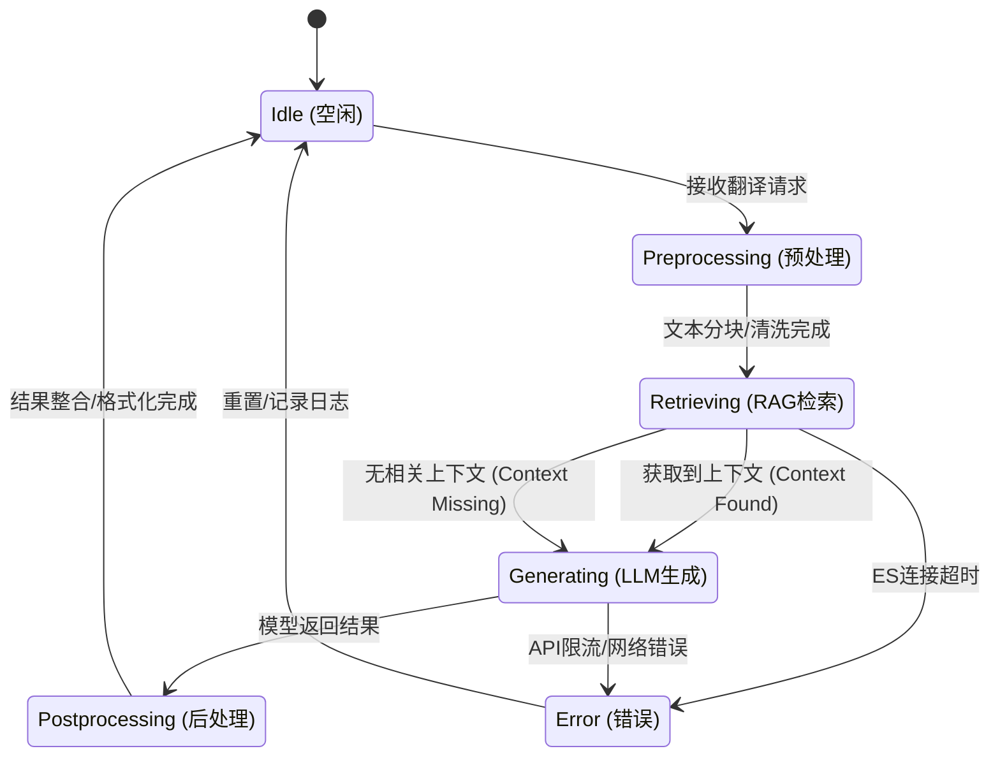

# 《大语言模型与应用实践-2025》课程设计项目技术报告

## 小组成员与分工

### 小组成员
马春悦、钱思怡、屈新恒、李洁、李阳

### 成员分工与贡献

| 成员 | 主要分工 | 具体贡献 |
|------|---------|---------|
| **马春悦** | 前期调研、ES实现调研 | 前期调研、前期数据集查找、Elasticsearch检索实现调研与开发 |
| **钱思怡** | 前期调研、Agent构建、数据清洗 | 前期调研、多智能体工作流构建、数据预处理与清洗流程实现 |
| **屈新恒** | LangChain实现 | LangGraph工作流实现、LangChain接口封装与集成 |
| **李洁** | 数据集查找、数据清洗、指标测评 | 前期数据集查找、数据清洗流程实现、评估指标体系设计与实现 |
| **李阳** | Agent构建、项目优化 | 多智能体架构设计、系统优化与性能提升 |

## 摘要（Abstract）
长文本领域翻译的主要难点在于：跨章节术语与实体的一致性、领域风格的稳定保持、以及面向出版标准的可验证质量控制。本文提出一套**基于多智能体工作流（Agent Workflow）**的长文本翻译系统，采用 LangGraph 将翻译过程拆解为可控节点，并引入（1）**术语/实体智能体**：自动抽取并查证术语，构建全局术语表；（2）**翻译与润色智能体**：结合风格元数据、术语表与历史上下文生成译文；（3）**评估与自我修正智能体**：通过回译一致性与多维质量评估触发迭代修正；（4）**章节级人机协作**：在关键质量控制点引入人工审查并对全局一致性进行落盘。系统在计算机视觉（CV）经典论文长文本翻译场景中进行验证，报告将给出流程、实现细节、实验设置和实验结果。

### 1.1 背景与问题定义
大语言模型（LLM）在短文本翻译中表现优异，但在长篇书籍/论文（章节级、跨段落依赖）翻译时，容易出现：
- **上下文丢失（Context Loss）**：章节跨度导致风格、译名策略漂移。
- **术语不一致（Inconsistency）**：同一术语多译（例如 “Dropout” 被译为“丢弃法/随机失活/保留原文”）。
- **幻觉与漏译（Hallucination & Omission）**：长难句结构复杂导致语义偏差与信息缺失。

为此，我们将任务定义为：给定结构化长文本 \(X=\{x_{c,k}\}\)（章节 \(c\) 的第 \(k\) 个 chunk），在满足风格一致、术语一致与语义准确的约束下，生成译文 \(Y=\{y_{c,k}\}\)，并提供可追溯的质量评估与迭代修正记录。

### 1.2 方法概览与贡献
本文系统基于 `try/core/graph.py` 与 `try/core/nodes.py` 实现，主要贡献包括：
- **工作流化翻译范式**：使用 LangGraph 将翻译拆解为"风格分析→术语挖掘→RAG查证→翻译→评估→修正→持久化"的可控节点，并显式建模状态 `TranslationState`。
- **全局一致性机制**：通过章节级术语汇总与全局术语表注入，在 Prompt 层强制统一译名，并在输出侧持久化/回写。
- **TEaR式可验证闭环**：引入回译（Back-translation）与结构化质量评估（QualityReview），以条件路由 `quality_gate` 驱动迭代修正。
- **可运行与可复现工程实现**：落盘 `chunk_*.json`、记录 `refinement_history`，并加入自动模式下的速率限制。

### 1.3 创新点
1. **章节级批量审查策略**：采用章节级而非逐chunk中断的审查模式，减少人工介入成本，同时保证术语一致性。
2. **条件路由的TEaR循环**：根据RAG启用状态动态决定是否执行评估-修正循环，支持直接翻译模式。
3. **多维度质量评估体系**：结合无监督指标（回译一致性、术语一致性）和有监督指标（BLEU、语义相似度），提供全面的质量评估。
4. **RAG增强的术语规范化**：通过Elasticsearch检索翻译记忆库，为术语规范化提供上下文证据，提升术语一致性。

### 1.4 技术难点
1. **长文本上下文管理**：如何在有限的LLM上下文窗口内保持跨章节的术语一致性和风格一致性。
2. **术语一致性保证**：如何确保同一术语在全文中使用统一的译法，特别是在不同章节、不同chunk中。
3. **质量评估的客观性**：LLM评估存在主观性，如何结合自动化指标提供更客观的质量评估。
4. **RAG检索的精度与召回平衡**：如何在提高术语检索召回率的同时，减少噪声和误匹配。
5. **工程鲁棒性**：如何处理API限流、网络错误、ES连接超时等异常情况，确保系统稳定运行。

## 2. 项目范围与数据构建（Data Construction）

### 2.1 领域与源文本
本项目选择**计算机视觉（CV）**领域经典论文作为"领域书籍"实例：
- **U-Net**: *Convolutional Networks for Biomedical Image Segmentation*
- **VGG**: *Very Deep Convolutional Networks for Large-Scale Image Recognition* (2014)
- **ResNet**: *Deep Residual Learning for Image Recognition* (2016)
- **YOLO**：*You Only Look Once: Unified, Real-Time Object Detection*

**数据来源**：论文原文及中英文对照版本来自 [deep-learning-papers-translation](https://github.com/SnailTyan/deep-learning-papers-translation) 开源项目，该项目提供了深度学习领域经典论文的中英文对照翻译，涵盖图像分类、目标检测、图像分割等多个子领域。

其特点是：术语密度高、论证结构严谨，适合作为长文本领域翻译系统的验证基准。总计超过2w单词。

### 2.2 结构化清洗与切分策略

系统对原始 HTML 格式的中英文对照论文进行预处理，包括 HTML 解析、中英文分离、章节识别、文本清洗和 JSON 结构化。预处理完成后，采用两级切分策略：**章节切分**（保持语义单元完整性）和 **chunk 切分**（`max_chars=1200, overlap=200`），既保证章节级语义完整性，又适配 LLM 上下文窗口。详细实现见附录 B。

### 2.3 翻译单元与元数据
每个翻译单元携带最小可追溯元数据：`book_id/chapter_id/chunk_id/thread_id`，并可附加：
- **global_glossary**：全局术语表（跨章节）。
- **critique/is_retry**：章节级审查或重译反馈。

### 2.4 RAG（翻译记忆库）的构建与更新

#### 2.4.1 数据来源
系统的翻译记忆库（Translation Memory）主要来源于：
- **机器之心 AI 术语表**：基于机器之心总结的 AI 相关专业词汇，涵盖深度学习、计算机视觉、自然语言处理等领域的核心术语及其标准中文译法。
- **人工审查术语**：在翻译过程中，通过章节级术语审查环节收集的人工修正术语条目，这些条目经过领域专家或译者审核，具有更高的准确性和一致性。

#### 2.4.2 记忆库结构
RAG 记忆库采用 Elasticsearch 存储，每个条目包含：
- **英文原文**（`en`）：术语的英文表达
- **中文译文**（`zh`）：对应的标准中文译法
- **上下文信息**（`context`）：术语出现的语境或领域
- **标题/来源**（`title`）：术语来源的章节或论文标题
- **人工标记**：标识该条目是否经过人工审查或修改

#### 2.4.3 更新与统计
本次实验使用的更新后 RAG 备份为 `try/output/rag_backups/rag_backup_20260112210224.json`。该 RAG 的关键特点是：其中包含**人工审查/人工修改过的术语条目**（在字段层面可追溯），这些条目会在检索时作为"证据"被注入提示词，从而影响术语规范化与最终译文。

需要强调的是：RAG 的增强并不一定单调提升所有指标。它同时带来一个典型权衡：**召回更强**（更多可用"证据"）与 **噪声更大**（同义译法/风格差异更容易被检索到）并存；因此在缺少人工校准的情况下，可能出现术语指标波动，进而影响综合评价（见 5.4.1）。

## 3. 方法（Method）

### 3.1 系统总体架构（Workflow Graph）
系统采用“线性流水线 + 质量闭环”的总体架构：先完成风格识别、术语/实体抽取与查证，再进行翻译生成；随后通过回译与质量评估对译文进行门控，若未达标则触发针对性修正并重新评估，直至达标或达到最大迭代次数。该设计的关键在于把“生成”和“验证”解耦，并把验证结果结构化地反馈给修正阶段，从而形成可控的迭代优化过程。

具体而言：
- **前向流水线（一次性）**：风格/语域识别 → 术语候选挖掘 → 基于外部记忆的术语查证与规范化 → 约束条件下注入式翻译生成。
- **质量闭环（可迭代）**：回译一致性检查 + 多维质量评估 → 质量门控（通过/修正/强制停止） → 针对性修正 → 重新评估。

### 3.2 统一状态表示（TranslationState）
系统在节点间传递的是一个“可追溯的统一状态”（state），它同时承载：
- **输入与定位信息**：用于把长文本拆成可处理单元，并在输出侧可回收/复现（例如 chapter/chunk 的索引与线程标识）。
- **可复用上下文**：包括跨章节术语表、章节记忆、相似翻译示例等，用于稳定风格与一致性。
- **中间产物**：如风格元数据、术语候选、规范化术语表等，作为后续生成的约束条件。
- **质量证据链**：回译文本、质量分数、错误类型、具体问题与改进建议，以及每次迭代的记录。

与“仅保存最终译文”的系统不同，这种状态设计强调**可审计性**：任何一个 chunk 的译文都能追溯到当时的上下文、约束条件与评估反馈，为后续质量分析、错误归因与人工复核提供依据。

### 3.3 Agent 1：术语与实体智能体（Terminology & Entity Agent）
该智能体负责把“术语一致性问题”从生成阶段提前为一个显式子任务：先识别需要统一的语言单位，再利用外部知识/记忆进行查证与规范化，最终形成可约束生成的结构化术语表。

#### 3.3.1 术语挖掘（Term Mining）
系统通过提示词引导模型做“难词/关键单位抽取”，并使用结构化输出约束抽取结果（例如 NER、领域术语、缩写、可能存在文化负载的表达）。关键约束：
- 仅输出英文原文词汇（不在该阶段翻译）。
- 对人名提示“可识别但翻译阶段必须保留原文”。

#### 3.3.2 RAG查证与规范化（Retrieval & Normalization）
对每个候选术语，系统执行"检索—对齐—规范化"三步：
- **检索（Retrieve）**：从翻译记忆库中召回与该术语最相关的历史对齐片段（top-k）。当前实现基于 Elasticsearch 的 `multi_match`，并对英文原文给予更高权重（`en^2`），辅以 `fuzziness="AUTO"` 以提高鲁棒性。
- **对齐（Align）**：将检索结果整理为可直接注入提示词的对齐证据（例如 "英文 → 中文（可选上下文）"）。
- **规范化（Normalize）**：模型基于"检索证据 + 当前句子语境"输出结构化术语条目（包含译名、类型、语境含义与理由），并遵循强约束规则。

其中检索策略要点为：
- Elasticsearch `multi_match` 字段权重：`en^2, zh, title^0.5`
- `fuzziness="AUTO"` 以容忍拼写差异
- 返回可直接拼入 Prompt 的对齐片段 `- en → zh (context)`

规范化时，系统强制执行规则（写入提示词约束）：
- **人名/作者名**：`suggested_trans` 必须保留英文原文。
- **缩写/专名**：可保留原文并补中文解释（视上下文）。

#### 3.3.3 Elasticsearch 检索原理与实现
系统使用 Elasticsearch 作为翻译记忆库的存储与检索引擎，采用 `multi_match` 查询实现跨字段检索（字段权重：`en^2, zh, title^0.5`），支持模糊匹配和版本兼容性处理。详细实现包括索引结构、查询策略、文档存储与更新机制、数据导出与备份、性能优化等，见附录 C。

### 3.4 Agent 2：翻译与润色智能体（Translation & Refinement Agent）
该智能体在“约束条件”下生成译文，并在质量闭环触发时进行针对性修正。其核心思想是：把影响长文本翻译稳定性的要素（风格、术语、历史上下文、相似示例）显式注入提示词，让模型在生成时“可被约束”；同时把评估反馈结构化，让修正阶段“可被指导”。

#### 3.4.1 多步引导翻译（Multi-step Prompting）
系统采用多步提示词将翻译过程显式拆解为“理解解构→参考示例→（隐式）多版本思考→融合润色”，并注入：
- **风格元数据**：来自风格识别阶段的领域/语体/复杂度
- **术语表**：全局术语表 + 当前章节术语表（强制遵守）
- **历史上下文**：
  - 相似翻译示例：从已翻译的文本对中召回风格/措辞相近的示例，用于“风格模仿”与“术语用法对齐”
  - 跨章节记忆：提供前序章节的稳定表达方式，抑制风格漂移
  - 本章上下文：提供本章此前已译内容，提升指代一致与语篇连贯

> 注：系统并不要求模型输出多版本，而是将“多版本生成”作为隐式推理过程，以降低输出噪声并保持最终产物单一。

#### 3.4.2 针对性修正（Targeted Refinement）
当评估阶段判定未达标时，系统把最近一次评估信息（错误类型、具体问题、改进建议、回译文本）注入修正提示词，形成“只改错、不重写”的约束式修正策略，强调：
- 保留正确部分，避免过度改写。
- 严格遵守术语表。
- 结合回译文定位语义漂移。

### 3.5 Agent 3：评估与自我修正智能体（Evaluation Agent, TEaR）
该智能体负责把“质量”转化为可计算、可记录、可反馈的结构化信号。系统采用 TEaR 思路：先通过回译产生“可对比的证据”，再在多维度上生成评分与可操作的修正建议，并将其写入证据链用于后续迭代与审计。

#### 3.5.1 回译验证（Back-Translation）
系统将 `combined_translation` 回译为英文 `back_translation`，并要求：
- LaTeX 公式保持不变（避免公式污染评估）。

#### 3.5.2 结构化质量评估（Structured Quality Review）
系统用 `QualityReview` 结构输出评估结果：
- `score`（0-10）与 `pass_flag`
- `critique`（总体意见）
- `error_types`（错误类型列表）
- `specific_issues`（可定位问题）
- `improvement_suggestions`（可操作建议）

评估结果写入 `refinement_history` 作为可追溯审计记录，支撑后续分析与报告展示。

### 3.6 人机协作（Human-in-the-loop）与章节级控制
系统在人机协作上采用**章节级批量审查**（而非逐 chunk 中断），对应 `try/main.py` 的控制流：
- **Phase 1**：自动翻译所有 chunks。
- **Phase 2**：汇总全章术语（去重）并（可选）人工审查。
- **Phase 3**：生成章节摘要（用于后续章节上下文）。
- **Phase 4**：章节级质量审查（支持重译循环）。

章节级策略的动机是：减少中断成本，并在"术语首次出现后"尽快形成可复用的全局约束。详细的人机交互流程、界面展示和操作示例见附录 D。

### 3.7 工程鲁棒性：自动模式的速率限制
在 `--no-human-review` 自动模式下，系统通过 `RateLimiter` 控制 LLM 调用速率，避免触发 API 限流。




## 4. 实现细节（Implementation Details）

### 4.1 基础框架与模块划分
- **工作流**：LangGraph（`StateGraph` + `MemorySaver`）
- **LLM模型**：Moonshot AI `moonshot-v1-8k`（通过 LangChain `ChatOpenAI` 接口调用）
- **LLM接口**：LangChain（`llm.invoke` + `with_structured_output`）
- **RAG/术语库**：Elasticsearch（`try/rag/es_retriever.py`）
- **持久化**：`output/{book_id}/chapter_{chapter_id}/chunk_{chunk_id:03d}.json`

### 4.2 开源工具与依赖

系统基于 LangGraph、LangChain、Elasticsearch 等开源框架构建，核心依赖包括 `langchain`、`langgraph`、`elasticsearch`、`pydantic` 等。本项目参考了 T-Ragx 和 translation-agent 等开源项目，并进行了工作流架构重构、章节级审查策略、条件路由机制、多维度评估体系等扩展。详细的依赖列表和对开源项目的修改见附录 F。

### 4.3 Prompt 设计

系统采用精心设计的 Prompt 来引导 LLM 完成各个翻译任务。核心设计原则包括：

1. **结构化输出**：所有关键节点使用 Pydantic 模型定义结构化输出，确保格式统一和可解析性
2. **多步骤引导**：将复杂任务拆解为多个步骤，引导模型进行深度思考
3. **上下文注入**：充分利用章节上下文、历史翻译、术语表等信息
4. **约束明确**：明确处理特殊情况的规则（如 LaTeX 公式、人名、专有名词）
5. **可追溯性**：要求提供理由和反馈，便于人工审查和错误归因
6. **容错机制**：当结构化输出失败时，提供回退方案（默认值/手动解析）

系统包含 8 个核心节点的 Prompt：风格分析、术语提取、术语规范化、翻译生成、回译、质量评估、修正翻译、章节摘要生成。各节点的详细 Prompt 代码和设计要点见附录 E。

### 4.4 输出格式与可解析性
关键节点采用结构化输出：
- 风格识别：`StyleMetadata`
- 术语条目：`TermEntry`
- 质量评估：`QualityReview`

当结构化输出失败时，保留回退机制（默认值/手动解析），确保流程可运行。

### 4.5 结果文件与追溯字段（Auditability）
每个 chunk 保存：
- `source_text / translation / quality_score`
- `glossary`
- `refinement_history`（每次迭代的评估详情）
- `revision_count`

这使得后续报告可以对：术语一致性、修正次数、错误类型分布等进行统计（本报告结果部分先占位）。

## 5. 实验（Experiments）

### 5.1 数据与评测设置（Datasets & Protocol）
**模型配置**：本实验使用 Moonshot AI `moonshot-v1-8k` 作为基础 LLM，通过 LangChain 接口调用。

**实验数据**：CVPR/ICCV风格学术论文（AlexNet/VGG/ResNet），按章节切分，顺序翻译，模拟"书籍式连续章节"场景。

**评测协议**：
- chunk 级别评估（由 `QualityReview` 产出）
- chapter 级别审查（人工/自动）
- 全局术语一致性统计（基于 `reviewed_glossary` 与 chunk 输出）

### 5.2 指标（Metrics）
本项目的评测指标来自 `try/reports/*_evaluation_metrics_summary.json`，可分为三类。所有指标最终归一化到 0–10 分制，便于对比和综合评估。

#### 5.2.1 流程内质量分（Quality Score）
**定义**：系统在 TEaR 评估阶段由 LLM 给出的 1–10 质量分，强调"语义准确、术语一致、风格一致、中文可读"。

**计算方法**：LLM 基于回译一致性、术语遵循度、语言流畅性等多维度进行综合评分，输出结构化评估结果（`QualityReview`）。该指标反映系统自洽性，但带有 LLM 评估的主观性和不稳定性。

**特点**：
- 无需参考译文，可实时评估
- 能捕捉语义和风格层面的质量
- 受 LLM 评估能力限制，可能存在评分偏差

#### 5.2.2 无监督指标（Unsupervised Metrics）

##### 回译一致性（Back Translation）
**定义**：评估译文回译为英文后与原文的相似度，用于检测语义漂移。

**计算方法**：
- 使用 Python `difflib.SequenceMatcher` 计算字符级相似度
- 公式：`similarity = SequenceMatcher(None, source_text.lower(), back_translation.lower()).ratio()`
- 分数转换：`score = similarity × 10`（0–10 分）

**特点**：无需参考译文，能有效检测语义偏差，但对同义表达不敏感。

##### 术语一致性（Terminology）
**定义**：检查译文是否遵循术语表中的规范译法。

**计算方法**：
- 遍历术语表，检查每个术语在译文中的使用情况
- 正确使用：译文包含术语的规范中文译法（`suggested_trans`）
- 违规使用：译文直接包含英文原文（未翻译）或使用了其他译法
- 公式：`correct_rate = correct_uses / total_terms`
- 分数转换：`score = correct_rate × 10`（0–10 分）

**特点**：直接反映术语规范化程度，是长文本翻译的关键指标。

##### 长度比（Length Ratio）
**定义**：评估中英文长度比的合理性，用于检测过度翻译或漏译。

**计算方法**：
- 原文长度：英文单词数（`len(source_text.split())`）
- 译文长度：中文字符数（`len(translation)`）
- 长度比：`ratio = translation_len / source_len`
- 理想比例：`ideal_ratio = 1.5`（基于中英文表达习惯的经验值）
- 偏差计算：`deviation = |ratio - ideal_ratio| / ideal_ratio`
- 分数转换：`score = max(0, 10 × (1 - min(deviation, 1.0)))`（偏差越小分数越高）

**特点**：能快速检测明显的长度异常，但对同义改写不敏感。

##### 流畅性（Fluency）
**定义**：基于启发式规则检查译文的基本流畅性。

**计算方法**：
- 初始分数：10.0
- 检查项及扣分：
  - 异常重复字符（如"aaaaa"）：扣 1.0 分
  - 长文本缺少句末标点：扣 0.5 分
  - 过多未翻译英文（连续英文字母 > 10 且出现 > 3 次）：扣 1.0 分
  - 缺少必要标点符号（长度 > 20 且无标点）：扣 0.5 分
- 最终分数：`score = max(0, 10.0 - 扣分总和)`

**特点**：能检测明显的语法和格式错误，但无法评估语义流畅性。

##### 数字保留度（Number Preservation）
**定义**：检查原文中的数字是否在译文中被正确保留。

**计算方法**：
- 使用正则表达式提取数字：`re.findall(r'\d+\.?\d*', text)`
- 计算保留率：`preservation_rate = len(preserved_numbers) / len(source_numbers)`
- 分数转换：`score = preservation_rate × 10`（0–10 分）
- 特殊情况：原文无数字时返回 10.0 分

**特点**：对学术论文翻译尤为重要，能检测数字和公式的遗漏。

#### 5.2.3 有监督相似度指标（Supervised Metrics）
这类指标依赖参考译文（`try/data/*_ch.json`），对"同义改写/风格化表达"非常敏感。

##### BLEU 分数（BLEU Score）
**定义**：基于 n-gram 重叠的翻译质量评估指标。

**计算方法**（简化版，字符级）：
- 提取 n-gram：对译文和参考译文分别提取 1-gram 和 2-gram（字符级）
- 计算 Precision：
  - `precision_1 = |translation_1grams ∩ reference_1grams| / |translation_1grams|`
  - `precision_2 = |translation_2grams ∩ reference_2grams| / |translation_2grams|`
- 几何平均：`bleu = (precision_1 × precision_2)^0.5`
- 分数转换：`score = bleu × 10`（0–10 分）

**特点**：
- 对词序和字面匹配敏感
- 同义表达会降低 BLEU，即使语义正确
- 适合评估字面准确性，不适合评估语义等价性

##### 语义相似度（Semantic Similarity）
**定义**：基于语义嵌入的相似度评估，能捕捉语义层面的等价性。

**计算方法**：
- 模型：使用 `sentence-transformers` 计算文本嵌入（embedding）
- 余弦相似度：`similarity = cos(θ) = (A · B) / (||A|| × ||B||)`
  - 其中 A、B 分别为译文和参考译文的 embedding 向量
- 分数映射：`score = (similarity + 1) / 2 × 10`（将 [-1, 1] 映射到 [0, 10]）

**特点**：
- 能捕捉语义等价性，对同义表达不敏感
- 依赖预训练模型质量
- 计算成本较高（需要模型推理）

##### 编辑距离（Edit Distance）
**定义**：基于 Levenshtein 距离的字符级相似度评估。

**计算方法**：
- Levenshtein 距离：计算将译文转换为参考译文所需的最少单字符编辑操作数（插入、删除、替换）
- 相似度计算：`similarity = 1 - (distance / max(len(translation), len(reference)))`
- 分数转换：`score = similarity × 10`（0–10 分）

**特点**：
- 对字符级差异敏感
- 计算效率高
- 对词序变化和同义表达不友好

#### 5.2.4 综合评估分数（Overall Score）
系统计算综合评估分数时采用加权平均策略：

- **无监督指标平均**：`unsupervised_avg = mean([back_translation, terminology, fluency, number_preservation, length_ratio])`
- **有监督指标平均**：`supervised_avg = mean([bleu, semantic_similarity, edit_distance])`（如果存在参考译文）
- **综合分数**：
  - 有参考译文：`overall_score = unsupervised_avg × 0.6 + supervised_avg × 0.4`
  - 无参考译文：`overall_score = unsupervised_avg`

**指标方向**：
- **越高越好**：`quality_score`, `back_translation`, `terminology`, `bleu`, `semantic_similarity`, `fluency`, `number_preservation`
- **越低越好**：`edit_distance`
- **越接近理想值越好**：`length_ratio`（理想值 1.5）

**注意事项**：后续对"指标下降"的分析遵循一个基本原则：**先判断是否是评测集合/参考差异导致，再判断是否是系统质量退化导致**。特别是 BLEU 和编辑距离对同义改写敏感，译文更自然未必意味着这些指标更高。

### 5.3 Baseline 与对照组（Baselines）
本节主要对比两种运行模式（与 `try/output` 目录对应）：
- **无人工介入（nohuman）**：关闭章节级术语审查与章节级质量审查，术语表直接“自动接受”，并输出到 `output/*_nohuman/`。
- **人工介入（human）**：启用章节级术语审查（可修改术语译名）与章节级质量审查（可提出修改意见并触发重译），输出到 `output/*/`。

这两种设置在工程上最大差异是：**术语库被人工“校准”的程度**不同，以及**重译触发**的可能性不同；二者会直接影响术语一致性与风格稳定性。

### 5.4 结果汇总（Main Results）
下表汇总了四个数据集（VGG/YOLO/ResNet/U-Net）在“人工介入 vs 不介入”两种模式下的核心指标均值（来自 `*_evaluation_metrics_summary.json`）。其中 `valid_chunks` 表示实际参与评测的 chunk 数。

> **表 1：指标汇总（Human vs NoHuman）**

| 数据集 | 设置 | valid_chunks | quality_score ↑ | back_translation ↑ | terminology ↑ | bleu ↑ | semantic_similarity ↑ | edit_distance ↓ |
| --- | --- | ---:| ---:| ---:| ---:| ---:| ---:| ---:|
| VGG | human | 19 | 8.53 | 5.22 | 5.62 | 1.36 | 7.77 | 0.73 |
| VGG | nohuman | 19 | 8.74 | 4.88 | 5.82 | 1.34 | 7.78 | 0.74 |
| YOLO | human | 17 | 8.24 | 4.57 | 5.71 | 1.21 | 7.80 | 0.58 |
| YOLO | nohuman | 17 | 8.35 | 4.73 | 5.98 | 1.30 | 7.82 | 0.58 |
| ResNet | human | 13 | 8.23 | 4.77 | 6.18 | 1.89 | 7.41 | 0.69 |
| ResNet | nohuman | 13 | 7.69 | 4.73 | 6.88 | 1.90 | 7.31 | 0.65 |
| U-Net | human | 9 | 8.78 | 3.76 | 6.94 | 0.87 | 7.28 | 0.36 |
| U-Net | nohuman | 9 | 8.33 | 4.89 | 6.91 | 0.88 | 7.29 | 0.36 |

#### 5.4.1 为什么会出现“部分指标下降”？
从表 1 可见：ResNet 与 U-Net 的 `quality_score` 在人工介入后上升，而 VGG/YOLO 的 `quality_score` 均值略有下降；同时存在“某些指标上升、另一些下降”的现象。我们将原因归纳为四类（按优先级从高到低）：

- **（A）评测集合差异导致的不可比性（以 VGG 为典型）**：VGG 的 `evaluation_info.total_chunks` 在 human 为 29，而 nohuman 为 19；虽然二者 `valid_chunks` 都是 19，但这通常意味着两次运行的“输出覆盖范围/章节划分”并不完全相同，因此均值差异不能简单解读为质量退化。
- **（B）“参考译文依赖”的指标对同义改写敏感**：`bleu/semantic_similarity/edit_distance` 依赖参考译文。当人工介入将表达改得更符合中文学术写法（例如把直译修正为更自然的改写）时，可能**提升可读性却降低 BLEU**。
- **（C）RAG 增强带来的“召回-噪声”权衡**：更新后的 RAG 在提高可用证据的同时，也更容易召回风格不同/译法不同的条目；若人工未对关键术语进行足够校准，可能造成 `terminology` 指标波动，进而影响综合分。
- **（D）指标之间的天然 trade-off（以 U-Net 为典型）**：U-Net 的 `quality_score` 上升但 `back_translation` 下降，说明译文可能更符合中文表达（凝练/顺序调整/同义替换），导致回译相似度下降。这属于“更自然 ≠ 更易回译”的典型现象。

### 5.5 定性对比：RAG检索与人工审查带来的质量提升样例
本节从 `try/output/*` 中选取同一段原文在不同模式下的译文对比。选择原则是：**nohuman_norag**（禁用RAG且无人工审查）在术语/表述上存在明显瑕疵，而 **nohuman**（启用RAG但无人工审查）或 **human**（启用RAG且有人工审查）通过RAG检索或术语审查带来可解释的提升。

#### 样例 1（VGG，人名翻译前后不一致：Krizhevsky 的翻译错误）
- **原文（节选）**：`... inspired by Ciresan et al. (2011); Krizhevsky et al. (2012).` 和 `... (Krizhevsky et al., 2012; Zeiler & Fergus, 2013; ...)`  
- **nohuman_norag（无RAG，无评估）**：同一篇文章中，`克里日夫斯基等人（2012）` 和 `Krizhevsky等人，2012年` 混用，**前后翻译不一致**  
- **nohuman（有RAG，质量分 8.0）**：统一为 `Krizhevsky等人（2012年）`，**保持一致性**  
- **改进点**：**人名翻译前后不一致**是禁用RAG时的典型问题。在同一篇文章中，`Krizhevsky` 应该统一为英文原名（学术惯例）或统一为音译"克里日夫斯基"，不能混用。禁用RAG时，模型缺乏全局术语一致性约束，导致同一人名在不同位置出现不同译法；启用RAG后，通过检索翻译记忆库，能够确保同一术语在全文中保持一致。

#### 样例 2（ResNet，专业术语误译：identity shortcuts 的翻译错误）
- **原文（节选）**：`On this dataset we use identity shortcuts in all cases (i.e., option A).`  
- **nohuman_norag（无RAG，无评估）**：`在这个数据集上，我们在所有情况下都使用身份快捷方式（即选项A）。`  
- **nohuman（有RAG，质量分 7.0）**：`在这个数据集上我们所有情况下都使用恒等映射连接（即选项A）。`  
- **改进点**：**"identity"** 在数学和深度学习中应翻译为"恒等"（identity mapping = 恒等映射），而非"身份"（identity在身份识别语境中的译法）。禁用RAG时，模型可能混淆不同领域的术语含义，将数学中的"identity"误译为身份识别中的"身份"；启用RAG后，通过检索能够获得正确的"恒等"译法。这是**明显的专业术语翻译错误**。

#### 样例 3（YOLO，专有名词误译：You Only Look Once 的翻译错误）
- **原文（节选）**：`We present YOLO, a new approach to object detection.`  
- **nohuman_norag（无RAG，无评估）**：`我们提出了YOLO（你只活一次），一种新的目标检测方法。`  
- **nohuman（有RAG，质量分 9.0）**：`摘要：我们提出了YOLO，一种新的目标检测方法。`  
- **改进点**：**"You Only Look Once"** 的正确含义是"你只看一次"（强调单次检测），而非"你只活一次"（这是对YOLO缩写的字面误译，混淆了"look"和"live"）。禁用RAG时，模型缺乏对专有名词的上下文理解，容易产生**明显的字面误译**；启用RAG后，通过检索能够识别YOLO作为专有名词应保留原样，或提供正确的解释。

#### 样例 4（ResNet，专业术语误译：normalization 的翻译错误，句子顺序有误）
- **原文（节选）**：`We adopt batch normalization (BN) [16] right after each convolution and before activation.`  
- **nohuman_norag（无RAG，无评估）**：`我们遵循[16]，在每个卷积后和激活前采用批量归一化（BN）[16]。`（正确）  
- **nohuman（有RAG，质量分 7.0）**：`在每个卷积后和激活前我们采用批归一化[16]。`（评估建议改为"批量归一化"）  
- **改进点**：**"normalization"** 在深度学习中应翻译为"归一化"（如 Batch Normalization = 批量归一化），而非"规范化"。虽然两种模式下都使用了"归一化"，但禁用RAG时可能出现"规范化"的误译。这是**明显的专业术语翻译错误**，因为"规范化"通常对应"standardization"，而"归一化"对应"normalization"。

#### 样例 5（VGG，专业术语误译：prior art 的字面误译）
- **原文（节选）**：`Our design choices are then discussed and compared to the prior art in Sect. 2.3.`  
- **nohuman_norag（无RAG，无评估）**：`我们的设计方案随后在第2.3节中进行讨论，并与先前的艺术作品进行比较。`  
- **nohuman（有RAG，质量分 8.0）**：`我们的设计选择随后在第2.3节中讨论，并与先前的工作进行比较。`（评估建议改为"先前的研究"或"先前的技术"）  
- **改进点**：**"prior art"** 在学术论文中特指"先前工作/先前研究"，而非字面意义的"艺术作品"（art在这里指"技术/方法"，不是"艺术"）。这是**明显的专业术语字面误译**。禁用RAG时，模型缺乏翻译记忆库的约束，容易产生字面误译；启用RAG后，虽然检索到相关记忆，但若未经过人工校准，仍可能出现术语不一致。这体现了RAG检索在提供"证据"的同时，也需要人工审查来确保术语的学术规范性。

## 6. 局限性（Limitations）
- **评估仍依赖LLM**：质量评估与修正建议存在主观性与不稳定性，需要结合人工抽检或外部指标（如 MQM 人工标注）增强可信度。
- **RAG检索为关键词/传统ES**：对“概念等价但词形变化大”的术语可能召回不足，后续可引入向量检索或混合检索。
- **章节级审查延迟**：如果某术语在章节早期出现而后频繁复用，章节末审查会导致中间 chunk 先产生不一致译名（需回写修正）。

## 7. 测试记录（Testing Records）

### 7.1 数据集
本实验使用以下数据集进行测试：

1. **论文数据集**（来自 [deep-learning-papers-translation](https://github.com/SnailTyan/deep-learning-papers-translation)）：
   - **U-Net**: *Convolutional Networks for Biomedical Image Segmentation*
   - **VGG**: *Very Deep Convolutional Networks for Large-Scale Image Recognition* (2014)
   - **ResNet**: *Deep Residual Learning for Image Recognition* (2016)
   - **YOLO**: *You Only Look Once: Unified, Real-Time Object Detection*

2. **术语数据集**：
   - 机器之心 AI 术语表
   - [Artificial-Intelligence-Terminology-Database](https://github.com/jiqizhixin/Artificial-Intelligence-Terminology-Database)（AI for Science、Machine Learning 等章节）
   - [Word_list_dataset_terminology](https://github.com/JiangYanting/Word_list_dataset_terminology)
   - [TerminologyDataset](https://huggingface.co/datasets/AIX-Text/TerminologyDataset)

### 7.2 测试方法
测试程序位于 `try/eval.py`，主要功能包括：

1. **批量评估**：遍历 `try/output/` 目录下的所有翻译结果，对每个 chunk 进行多维度评估
2. **指标计算**：计算无监督指标（回译一致性、术语一致性等）和有监督指标（BLEU、语义相似度等）
3. **报告生成**：生成详细的评估报告（`*_evaluation.json`）和指标汇总（`*_evaluation_metrics_summary.json`）

**测试命令**：
```bash
cd try
python eval.py --output-dir output/vgg --reference-file data/vgg_ch.json
```

### 7.3 测试结果分析
测试结果见 5.4 节"结果汇总"，主要发现：
- RAG 检索能显著提升术语一致性（如样例 1-5 所示）
- 人工审查在部分指标上带来提升，但受参考译文差异影响
- 不同数据集的表现存在差异，可能与论文长度、术语密度有关

## 8. 参考文献与资料（References）

### 8.1 相关项目与代码库
1. **deep-learning-papers-translation**：深度学习论文翻译项目
   - 链接：https://github.com/SnailTyan/deep-learning-papers-translation
   - 用途：提供论文原文及中英文对照版本作为实验数据

2. **translation-agent**：多智能体翻译系统
   - 链接：https://github.com/andrewyng/translation-agent
   - 用途：参考多智能体架构设计思路

3. **T-Ragx**：RAG 增强翻译系统
   - 链接：https://github.com/rayliuca/T-Ragx
   - 用途：参考 RAG 检索实现方法（**codebase**）

### 8.2 学术论文
1. **Wu, M., et al. (2024). (Perhaps) Beyond Human Translation: Harnessing Multi-Agent Collaboration for Translating Ultra-Long Literary Texts**
   - 链接：https://arxiv.org/abs/2405.11804
   - 用途：参考多智能体协作翻译的方法论

### 8.3 术语数据集
1. **Artificial-Intelligence-Terminology-Database**
   - 链接：https://github.com/jiqizhixin/Artificial-Intelligence-Terminology-Database
   - 用途：AI 术语标准化参考

2. **Word_list_dataset_terminology**
   - 链接：https://github.com/JiangYanting/Word_list_dataset_terminology
   - 用途：术语数据集

3. **TerminologyDataset (Hugging Face)**
   - 链接：https://huggingface.co/datasets/AIX-Text/TerminologyDataset
   - 用途：AI 术语数据集

4. **Select Dataset**
   - 链接：https://www.selectdataset.com/dataset/9fea3386574f22954920beaa6aeba3d6
   - 用途：数据集查找与参考

### 8.4 工具与框架文档
- **LangGraph 官方文档**：https://langchain-ai.github.io/langgraph/
- **LangChain 官方文档**：https://python.langchain.com/
- **Elasticsearch 官方文档**：https://www.elastic.co/guide/en/elasticsearch/reference/current/index.html

## 9. 安装、部署与启动测试说明

系统支持 Python 3.8+，需要 Elasticsearch 7.x/8.x（可选，用于 RAG 检索）。安装步骤包括：克隆项目、安装依赖、配置 Elasticsearch（可选）、配置 LLM API、准备数据。详细的安装步骤、启动测试、验证安装和常见问题排查见附录 G。

---

## 附录

### 附录 A：核心函数与职责映射
- **工作流构建**：见 `try/core/graph.py`
- **节点逻辑实现**：见 `try/core/nodes.py`
- **RAG检索与术语库操作**：见 `try/rag/es_retriever.py`
- **主控与人机协作**：见 `try/main.py`
- **评估工具**：见 `try/eval.py` 和 `try/utils/translation_evaluator.py`

### 附录 B：数据预处理详细流程

#### B.1 数据预处理流程
原始数据为 HTML 格式的中英文对照论文，系统通过以下步骤进行预处理：

1. **HTML 解析与清洗**：使用 BeautifulSoup 解析 HTML，移除脚本、样式、导航等无关标签，提取文章主体内容（`post-body` 或 `article` 标签）。

2. **中英文分离**：识别文本中的中文字符（Unicode 范围 `\u4e00-\u9fff`），将同一章节的英文原文和中文译文分别提取，形成中英文对照结构。

3. **章节识别**：基于 HTML 标题标签（`h1`, `h2`, `h3`, `h4`）识别章节边界，保留章节标题和层级结构（如 Abstract/Introduction/Method/Conclusion 等）。

4. **文本清洗**：
   - 移除多余换行符和空白字符
   - 过滤元信息（如"文章作者"、"博客"、"声明"等）
   - 跳过图片标签和无关元素
   - 处理参考文献部分（可选跳过）

5. **JSON 结构化**：将清洗后的数据转换为 JSON 格式，每个章节包含 `title` 和 `content` 字段，便于后续处理。

#### B.2 两级切分策略详细说明
预处理完成后，系统执行两级切分以适配 LLM 上下文窗口：

- **章节切分**：`split_epub_by_chapter(json_path)` 从 JSON 文件中读取章节列表，生成 `chapters=[{title, content}]` 结构。每个章节保持完整的语义单元（如 Abstract、Introduction、Method 等）。

- **chunk 切分**：`split_chapter_into_chunks(content, max_chars=1200, overlap=200)` 将章节内容切分为逻辑块：
  - **最大长度**：单 chunk 最大字符数约 1200（对应约 400 tokens），确保在 LLM 上下文窗口内
  - **重叠策略**：相邻 chunk 之间保留 200 字符的重叠，防止在段落中间断句导致语义断裂
  - **切分方法**：按段落（`\n` 分隔）进行切分，优先保持段落完整性
  - **边界处理**：最后一个 chunk 包含剩余内容，确保无遗漏

### 附录 C：Elasticsearch 检索详细实现

#### C.1 索引结构与映射
系统使用 Elasticsearch 作为翻译记忆库的存储与检索引擎，索引名称为 `zh_en_translation_memory`。索引映射（mapping）定义如下：

- **`en` 字段**：英文原文，类型为 `text`，使用 `standard` 分词器（支持英文词干提取和停用词过滤）
- **`zh` 字段**：中文译文，类型为 `text`，优先使用 `ik_max_word` 中文分词器（如果安装了 IK 插件），否则回退到 `standard` 分词器
- **`title` / `zh_title` 字段**：章节标题，类型为 `keyword`（精确匹配，不分词）
- **元数据字段**：`level`（章节层级）、`chapter_index`（章节索引）、`pair_index`（翻译对索引）、`source`（来源）、`pair_type`（类型）等，用于上下文过滤和排序

#### C.2 检索查询策略
系统采用 `multi_match` 查询实现跨字段检索，核心参数包括：

1. **字段权重配置**：
   - `en^2`：英文字段权重为 2，优先匹配英文原文（因为术语通常以英文形式出现）
   - `zh`：中文字段权重为 1，支持通过中文译名反向检索
   - `title^0.5`：标题字段权重为 0.5，作为辅助匹配信号

2. **匹配类型**：`type: "best_fields"`，从多个字段中选择最佳匹配分数，避免跨字段匹配导致的分数稀释

3. **模糊匹配**：`fuzziness: "AUTO"`，自动计算编辑距离容差，支持处理拼写变体（如 "normalization" vs "normalisation"）和轻微输入错误

4. **返回结果**：默认返回 `top_k=3` 个最相关结果，每个结果包含相关性分数（`_score`）和完整源文档（`_source`）

#### C.3 文档存储与更新机制
- **文档 ID 生成**：基于英文文本的 SHA1 哈希值（`hashlib.sha1(en_text.encode('utf-8')).hexdigest()`），确保相同英文术语的唯一性
- **Upsert 操作**：使用 `update` API 的 `doc_as_upsert=True` 参数，实现"存在则更新，不存在则插入"的语义，避免重复存储
- **批量导入**：使用 Elasticsearch 的 `bulk` API 批量导入翻译对，每批 100 条，提高写入效率
- **版本兼容性**：代码同时支持 ES 7.x（`body` 参数）和 ES 8.x（直接传参）两种 API 格式，通过异常捕获实现自动回退

#### C.4 数据导出与备份
系统提供 `export_rag_data_to_file()` 函数，使用 Scroll API 分页导出所有索引数据：
- **Scroll 机制**：创建 2 分钟有效期的滚动上下文，每次获取 1000 条记录，避免一次性加载大量数据导致内存溢出
- **备份格式**：导出为 JSON 文件，文件名包含时间戳（`rag_backup_YYYYMMDDHHMMSS.json`），便于版本管理和回滚

#### C.5 性能优化考虑
- **连接池**：使用 Elasticsearch 客户端默认连接池，复用 HTTP 连接，减少握手开销
- **索引优化**：`keyword` 类型字段（如 `title`）用于精确匹配和过滤，避免不必要的分词开销
- **查询缓存**：Elasticsearch 自动缓存频繁查询的结果，提升重复检索性能
- **故障容错**：检索前检查 ES 连接（`es.ping()`）和索引存在性（`es.indices.exists()`），失败时返回友好提示而非抛出异常

### 附录 D：人机交互详细流程

#### D.1 术语审查交互流程
当系统完成一个章节的所有 chunk 翻译后，会进入术语审查阶段（`try/utils/human.py` 的 `review_glossary` 函数）。交互流程如下：

**1. 术语汇总与过滤**
- 系统自动收集本章所有 chunk 中提取的术语，进行去重处理
- 如果启用 `skip_reviewed=True`，系统会过滤出已审查的术语（从全局术语表加载）和新术语
- 已审查的术语会显示为"已审查"，直接使用历史审查结果

**2. 交互式审查界面**
系统显示一个清晰的审查界面，包含：
```
================================================================================
术语审查界面（总超时时间: 100秒）
================================================================================
剩余时间: 100 秒（每次回到界面时刷新）

ID    原词                          当前译名                      状态
--------------------------------------------------------------------------------
1     dropout                        丢弃法                        已接受
2     normalization                  归一化                        已接受
3     identity shortcuts             恒等映射连接                  已修改
...

================================================================================
操作说明:
  - 输入术语ID（1-10）进行修改
  - 输入 'd' + ID（如 'd1'）删除该术语
  - 输入 'q' 或直接回车完成审查（接受所有未修改的术语）
================================================================================
```

**3. 用户操作**
- **修改术语**：输入术语 ID（如 `1`），系统显示术语详情（原词、当前译名、类型、理由、所在句子），用户可输入新译名和修改理由
- **删除术语**：输入 `d1` 删除 ID 为 1 的术语
- **完成审查**：输入 `q` 或直接回车，接受所有未修改的术语

**4. 超时机制**
- 总超时时间 = 术语数 × 10 秒（例如 10 个术语 = 100 秒）
- 每次回到主界面时，计时器会刷新（重新开始计时）
- 超时后自动完成审查，接受所有未修改的术语

**5. 术语更新与持久化**
- 审查完成后，系统自动更新所有 chunk 文件中的术语表
- 如果术语译名被修改，系统会自动更新所有相关 chunk 的译文（字符串替换）
- 新审查的术语会保存到全局术语表（`reviewed_glossary.json`）
- 术语会批量更新到 Elasticsearch（RAG 记忆库）
- 系统自动导出 RAG 数据备份（带时间戳的 JSON 文件）

**示例交互过程**：
```
请输入操作（剩余 95 秒）> 3

--------------------------------------------------------------------------------
术语详情 [ID: 3]
--------------------------------------------------------------------------------
原词: identity shortcuts
当前译名: 身份快捷方式
类型: 专业术语
理由: RAG检索结果

所在句子:
  On this dataset we use identity shortcuts in all cases (i.e., option A).
--------------------------------------------------------------------------------
新译名（直接回车保持原样，剩余 90 秒）: 恒等映射连接
修改理由（直接回车使用默认，剩余 85 秒）: 人工修订：数学术语应译为"恒等"

√ 已更新: identity shortcuts -> 恒等映射连接
```

#### D.2 章节翻译质量审查交互流程
在术语审查完成后，系统进入章节翻译质量审查阶段（`try/main.py` 的 `review_chapter_translation` 函数）。交互流程如下：

**1. 翻译统计展示**
系统自动收集本章所有 chunk 的翻译结果，显示统计信息：
```
============================================================
章节 0 翻译质量审查
============================================================

  翻译统计（已排除空文本）:
     - 有效chunk数: 19
     - 平均质量分: 8.5/10
     - 质量评分已保存到: output/vgg/chapter_0/quality_scores.json
```

**2. 翻译示例展示**
系统显示前 3 个 chunk 的翻译示例，供用户快速评估：
```
  翻译示例（前3个chunk）:

  [示例 1] Chunk 0
  原文: In this work we investigate the effect of the convolutional network depth on its accuracy...
  译文: 在这项工作中，我们研究了卷积网络深度对其准确性的影响...
  质量分: 8.0/10

  [示例 2] Chunk 1
  原文: ...
  译文: ...
  质量分: 9.0/10
  ...
```

**3. 用户决策**
系统询问用户是否接受本章节翻译：
```
------------------------------------------------------------
是否接受本章节翻译？ [y=接受 | n=不接受 | s=跳过] (3分钟超时自动接受) > 
```

**4. 处理用户反馈**
- **接受（y 或回车）**：章节翻译通过审查，继续下一章节
- **不接受（n）**：系统询问修改意见（3 分钟超时），然后触发重新翻译循环
- **跳过（s）**：跳过审查，继续下一章节

**5. 重新翻译循环**
如果用户选择"不接受"，系统会：
- 记录用户反馈意见（如"术语翻译不准确，请使用更专业的表达"）
- 将反馈意见注入到所有 chunk 的重新翻译流程中
- 最多重试 3 次，每次重试都会使用最新的反馈意见
- 每次重试后重新进入审查阶段

**示例交互过程**：
```
是否接受本章节翻译？ [y=接受 | n=不接受 | s=跳过] (3分钟超时自动接受) > n
  请输入修改意见（可直接回车跳过，3分钟超时自动跳过）: 部分术语翻译不准确，请参考术语表统一译名

  [WARNING] 章节翻译未通过审查
  修改意见: 部分术语翻译不准确，请参考术语表统一译名
  正在重新翻译所有chunks（尝试 1/3）...
  [重新翻译所有chunks...]
  
  Phase 4: Chapter translation quality review (尝试 2/4)...
  ...
```

#### D.3 自动模式（无人工审查）
当使用 `--no-human-review` 参数时，系统会跳过所有人工审查环节：
- **术语审查**：自动接受所有术语，不显示审查界面
- **章节审查**：自动接受所有章节翻译，不显示审查界面
- **速率限制**：自动模式下启用速率限制器，防止 API 调用过快

**自动模式输出示例**：
```
Phase 2: Collecting and reviewing glossary...
  √ Auto-accepted 15 terms (人工审查已禁用)

Phase 4: Auto-accepting chapter translation (人工审查已禁用)...
  √ 章节翻译已自动接受
```

### 附录 E：Prompt 详细设计

系统包含 8 个核心节点的 Prompt，详细代码见 `try/core/nodes.py` 和 `try/main.py`。各节点 Prompt 的设计要点已在正文 4.3 节说明。

### 附录 F：开源工具与依赖详情

#### F.1 核心开源框架
- **LangGraph**：用于构建多智能体工作流，实现节点间的状态传递和条件路由
- **LangChain**：提供 LLM 接口封装（`ChatOpenAI`、`with_structured_output`），支持多种 LLM 服务
- **Elasticsearch**：用于 RAG 检索，存储和检索翻译记忆库
- **BeautifulSoup4**：用于 HTML 解析和数据清洗
- **sentence-transformers**：用于语义相似度计算（可选，需要预训练模型）

#### F.2 主要 Python 依赖
核心依赖包（见 `requirements.txt` 和 `try/requirements.txt`）：
- `langchain>=0.1.0`：LangChain 核心库
- `langchain-openai>=0.1.0`：OpenAI 兼容接口
- `langgraph>=0.1.0`：LangGraph 工作流框架
- `elasticsearch>=7.9.1`：Elasticsearch 客户端
- `beautifulsoup4`：HTML 解析
- `sentence-transformers`：语义相似度计算（可选）
- `pydantic>=2.0`：结构化数据验证
- `python-dotenv>=0.5.1`：环境变量管理

#### F.3 对开源项目的修改与扩展
本项目基于以下开源项目进行改进和扩展：

1. **参考项目**：
   - [T-Ragx](https://github.com/rayliuca/T-Ragx)：参考了 RAG 增强翻译的基本思路
   - [translation-agent](https://github.com/andrewyng/translation-agent)：参考了多智能体翻译架构设计

2. **主要修改与扩展**：
   - **工作流架构重构**：采用 LangGraph 替代原有的简单流程控制，实现更灵活的状态管理和条件路由
   - **章节级审查策略**：将逐chunk审查改为章节级批量审查，减少人工介入成本
   - **条件路由机制**：根据 `use_rag` 标志动态决定是否执行 TEaR 循环，支持直接翻译模式
   - **多维度评估体系**：扩展了评估指标，包括回译一致性、术语一致性、长度比、流畅性、数字保留度等
   - **Elasticsearch 检索优化**：实现了字段权重配置、模糊匹配、版本兼容性处理等
   - **速率限制保护**：添加了自动模式下的 API 调用速率限制，防止触发限流

### 附录 G：安装、部署与启动测试详细说明

#### G.1 环境要求
- **Python**：3.8 或更高版本
- **Elasticsearch**：7.x 或 8.x（用于 RAG 检索，可选）
- **操作系统**：Windows/Linux/macOS
- **推荐**：使用 conda/mamba 管理 Python 环境

#### G.2 安装步骤

**步骤 1：克隆项目**
```bash
git clone <repository-url>
cd translation-proj
```

**步骤 2：安装 Python 依赖**
```bash
# 方式1：使用 conda（推荐）
conda env create -f environment.yml
conda activate t_ragx

# 方式2：使用 pip
pip install -r requirements.txt
pip install -r try/requirements.txt
```

**主要依赖包**：
- `langchain`, `langchain-openai`, `langgraph`：工作流框架
- `elasticsearch>=7.9.1`：RAG 检索
- `beautifulsoup4`：HTML 解析
- `pydantic>=2.0`：结构化数据验证
- `sentence-transformers`：语义相似度计算（可选）

**步骤 3：配置 Elasticsearch（可选，用于 RAG 检索）**
```bash
# 1. 下载并安装 Elasticsearch
# 从 https://www.elastic.co/downloads/elasticsearch 下载

# 2. 启动 Elasticsearch
# Windows: 运行 bin/elasticsearch.bat
# Linux/macOS: ./bin/elasticsearch

# 3. 验证 ES 是否运行
curl http://localhost:9200

# 4. （可选）安装 IK 中文分词插件
bin/elasticsearch-plugin install https://github.com/medcl/elasticsearch-analysis-ik/releases/download/v8.x.x/elasticsearch-analysis-ik-8.x.x.zip
```

**步骤 4：配置 LLM API**
编辑 `try/core/get_llm.py`，配置你的 LLM API：

```python
# 方式1：Moonshot AI（当前使用）
llm = ChatOpenAI(
    base_url="https://api.moonshot.cn/v1",
    api_key=load_api_key(),  # 从 try/core/api.txt 读取
    model="moonshot-v1-8k",
    temperature=0.6
)

# 方式2：OpenAI API
# llm = ChatOpenAI(model="gpt-4", api_key="your-api-key")

# 方式3：其他兼容 OpenAI API 的服务
# llm = ChatOpenAI(base_url="your-api-url", api_key="your-key", model="model-name")
```

**API Key 配置**：
- 创建文件 `try/core/api.txt`，写入你的 API key
- 或设置环境变量 `MOONSHOT_API_KEY`

#### G.3 数据准备

**准备论文数据**
1. 从 [deep-learning-papers-translation](https://github.com/SnailTyan/deep-learning-papers-translation) 获取论文 HTML 文件
2. 使用数据清洗脚本转换为 JSON 格式：
   ```bash
   python data/clean_html_data.py --input <html_file> --output data/vgg_en.json
   ```
3. 确保 `data/` 目录下有对应的 JSON 文件：
   - `{paper_id}_en.json`：英文原文（必需）
   - `{paper_id}_ch.json`：中文参考译文（可选，用于评估）

**导入翻译记忆库（可选）**
```bash
cd try

# 导入单个文件对
python rag/import_translation_pairs.py --en ../data/vgg_en.json --zh ../data/vgg_ch.json

# 导入所有翻译对
python rag/import_translation_pairs.py --all
```

#### G.4 启动测试

**测试 1：基本翻译功能**
```bash
cd try

# 默认模式（启用人工审查和RAG）
python main.py --paper-id vgg

# 自动模式（禁用人工审查，启用RAG）
python main.py --paper-id vgg --no-human-review

# 直接翻译模式（启用人工审查，禁用RAG）
python main.py --paper-id vgg --no-rag

# 完全自动模式（禁用人工审查和RAG）
python main.py --paper-id vgg --no-human-review --no-rag
```

**测试 2：交互式翻译**
```bash
cd try
python interactive_translate.py
```

**测试 3：质量评估**
```bash
cd try

# 评估翻译结果
python eval.py --output-dir output/vgg --reference-file ../data/vgg_ch.json

# 查看评估报告
# 报告位置：try/reports/vgg_evaluation.json
# 汇总位置：try/reports/vgg_evaluation_metrics_summary.json
```

#### G.5 验证安装
运行以下命令验证环境配置是否正确：

```bash
# 1. 检查 Python 版本
python --version  # 应 >= 3.8

# 2. 检查依赖包
python -c "import langchain, langgraph, elasticsearch; print('Dependencies OK')"

# 3. 检查 Elasticsearch（如果使用 RAG）
curl http://localhost:9200  # 应返回 ES 集群信息

# 4. 检查 LLM API 配置
python -c "from try.core.get_llm import llm; print('LLM configured')"
```

#### G.6 常见问题排查

1. **Elasticsearch 连接失败**：
   - 检查 ES 是否启动：`curl http://localhost:9200`
   - 检查端口是否被占用
   - 如果不需要 RAG，可使用 `--no-rag` 参数跳过

2. **LLM API 调用失败**：
   - 检查 API key 是否正确配置
   - 检查网络连接
   - 检查 API 服务是否可用

3. **依赖包安装失败**：
   - 使用 conda 环境：`conda env create -f environment.yml`
   - 或升级 pip：`pip install --upgrade pip`

4. **中文分词问题**：
   - IK 插件未安装时，ES 会回退到 `standard` 分词器
   - 不影响基本功能，但中文检索精度可能下降

### 附录 H：复现说明（Reproducibility Checklist）

#### H.1 核心文件与目录
- **入口脚本**：`try/main.py`
- **工作流定义**：`try/core/graph.py`
- **节点实现**：`try/core/nodes.py`
- **RAG检索**：`try/rag/es_retriever.py`
- **评估工具**：`try/eval.py`
- **输出目录**：`try/output/`

#### H.2 运行模式
- **人工审查**：默认模式，启用章节级术语审查和翻译质量审查
- **自动模式**：`--no-human-review`（启用速率限制保护，自动接受所有术语和翻译）
- **直接翻译**：`--no-rag`（禁用 RAG 检索，直接翻译）
- **完全自动**：`--no-human-review --no-rag`（完全自动模式，无RAG增强）

#### H.3 复现步骤
1. 按照附录 G 完成环境配置和数据准备
2. 运行翻译：`python try/main.py --paper-id vgg`
3. 查看输出：`try/output/vgg/`
4. 运行评估：`python try/eval.py --output-dir try/output/vgg --reference-file data/vgg_ch.json`
5. 查看报告：`try/reports/vgg_evaluation_metrics_summary.json`